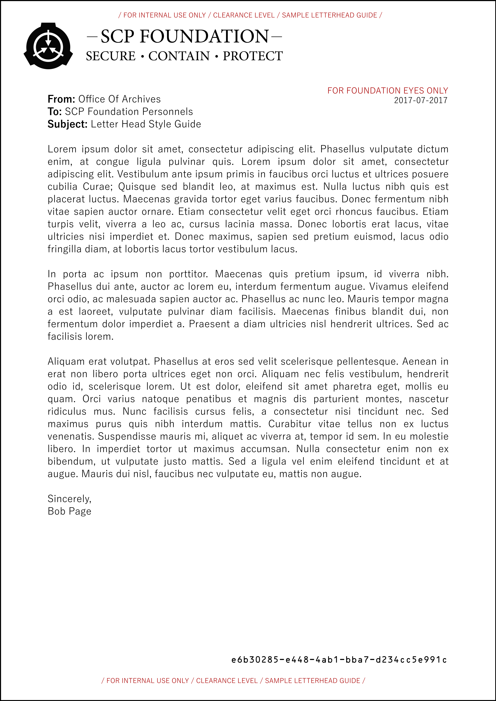

# SCP-Art-Repo

SCP - Secure Contain Protect Art Resources . E.g. letterheads etc... Style guide... for scp-wiki.net reddit.com/r/SCP/

Feel free to push a "pull request" to this repository, if you got any common SCP art that can be reused.

## Download

For those that just need the art and do not care so much about git or adding to this repository:

https://github.com/mofosyne/SCP-Art-Repo/archive/master.zip

## Revision log

[Who has contributed so far since v3.4](./Logo/Logo-Edit-Log.txt)

## Examples

A black version with transparancy enabled in the svg source, so it can be used in various background.

Letterhead style guide for found docuemtns stories:

Letterhead Banner if incorporating in a website instead.

## Licence

Creative Commons Attribution-ShareAlike 3.0 license https://creativecommons.org/licenses/by-sa/3.0/
